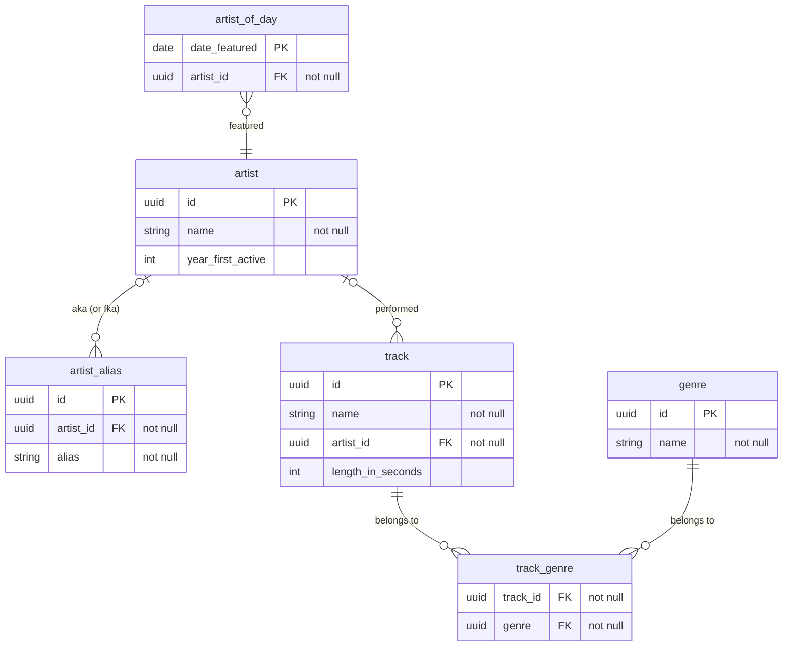

## Introduction

This Docker application contains a server and two Postgres databases (one for development, one for testing). Running the following command will start the app in development mode:

`docker-compose up`

Navigating to `localhost:3000/api` shows Swagger documentation for the endpoints and allows calls to be made. `localhost:3000/metrics` has metrics.

From the `artist-metadata` directory, tests can be run with `clojure -M:test` (or conversely with babashka at `bb test`; check `bb.edn` for other scripts.)

Run `docker ps` to get a list of containers and `docker exec -it <database container's name or id> psql -U postgres` to be able to make queries (for example, `select * from artist;`) directly on the database.

## Structure of Code

This project is coded in the Clojure coding language using the [`Kit`](https://kit-clj.github.io/) framework (relatively new—released only last year!—though similar to `Luminus`) .

Clojure is, by design, composable and modularized. As such, much of the functionality we'd expect from a service is available through libraries.

The `Integrant` library, which handles lifecycle / state management, is the "glue" that holds it all together. Generalized configurations are created in the `system.edn` file, which then can be initialized across the app.

## Assumptions (and their effects)

I assume the service will have many more reads than writes, and that read speed will matter more. I assume data around the entities will mostly remain structured (so: SQL is a good fit). The call fetching all of an artist's tracks would probably be common, so I preemptively added a database index.

### The Artist of the Day

Assumptions:

1. `artist` entities are or might become deletable, and being `artist-of-day` does not prevent an artist from being deleted.
2. Users should have the same `artist-of-day` for the entire calendar day in their local timezone (barring deletion)
   - Therefore, at any one moment, there are between two and three different `artist-of-day`s worldwide.
   - Users worldwide see the same particular `artist-of-day` for a given date.
3. The `artist-of-day` should not be blank.
   4 . _From requirements_ Artists should cycle through the `artist-of-day` designation in a set, repeating order

Unfortunately, a contradiction arises with these four assumptions. I would say it's clear that artists should be deletable. The other three could be argued. From my perspective, (4) can be dropped (I realize this was an explicit requirement; in a business setting I would have had a conversation about what strategy best serves business needs). The way I see it, the "unfairness" of an artist possibly getting short-shrift is outweighed by the user experience of never having a blank artist of day. Now in the corner-case of an `artist` being deleted during a featured date, a least-recent/never featured artist will fill the place.

A task updating-if-needed the `artist-of-day` is run every six hours. Furthermore, if a call to get the `artist-of-day` returns null, the updating-if-needed task will run again (though this condition doesn't check if the date is a current date.)

I'm not happy with this implementation as it stands. There are other options. I'll address this in the presentation.

### Artists and their Aliases

**tldr: An `artist` is a musical project. An `artist-alias` is another name for the same musical project**

In a real work environment, I'd talk to SMEs and try to figure out, on the domain-level, an _artist_ and an _alias_ actually are. A human being? A musical project? One particular name for a musical project?

In this context, I made the following assumption:

- An `artist` entity is a _musical project_.
- An `artist-alias` is a name that an `artist` is or was also known as.

From a musical metadata standpoint, I'd imagine that if you search for a particular artist, you'd want to return all the tracks for the associated musical project (including the same project by other names).

In the schema as it stands, there's no entity that indicates a "human being." One person can have one or more musical projects which are `artist`s, or can belong to a band which is an `artist`.

Thus changing the `artist` name and adding an `artist-alias` are two operations that are not necessarily related.

#### Examples

- In 2020, The Dixie Chicks changed their name to The Chicks. This band is currently an `artist` named "The Chicks." "The Dixie Chicks" is was formerly the `artist` name. Now it is an `artist-alias`.
- Hypothetical: Jane Smith has two solo projects—DJ A (sometimes billed as just "A") and DJ B. She is also part of a band. The band and the two DJ monikers are separate `artist` entities with no connection to one another in the current DB schema. "A" is an `artist-alias` for "DJ A." Jane Smith herself is not an `artist`.

## Left Incomplete

The task asked for a "production-ready" app; strictly speaking, that wasn't possible with the time I had. Parts of the codebase are handled with more care than others. Here are some aspects of "production-readiness" that are left incomplete:

- Cleaning up the verbose API logic to make it more readable / less error-prone.
- Error handling and validation. More stringent `malli` validation for the APIs and `try/catch`es around the DB calls, which return `400`s when, for example, a non-existent FK is passed in.
- - Cleaning up the `:set-artist-of-the-day-for-three-days!` code to be more DRY / maintainable.
- More robust testing (with DB fixtures) and unit tests.
- Caching
- Debug HTTP Logger (I added one, but it doesn't seem to work as advertised; `wrap-log-request-params` isn't functioning)
- Environment variables—currently postgres URLs are hard-coded
- Authentication / authorization
- Rate limiting
- GDPR
- Deployment processes
  - PR / Issue tracking templates
  - Deployment pipeline
  - Linter / automated testing
- The deployment itself (steps describe [here](https://kit-clj.github.io/docs/deployment.html#running_standalone)) is left undone.
- The API is not complete (some operations that would make sense for a functioning app are left undone).
- Separating the cron job into its own service so that the service can be replicated without it.

